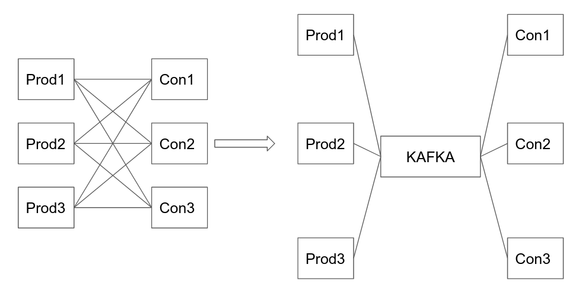

# Table of Contents

1. [What is Kafka?](#what-kafka)
2. [General use cases](#usecases)
3. [Kafka Python](#kafka-python)
4. [Workflow of the code](#code-workflow)
5. [Why is Kafka needed here?](#why-kafka)


# What is Kafka?<a name="what-kafka"></a>

- LinkedIn developed Kafka in 2011 as a high-throughput message broker for its own use, then open-sourced and donated Kafka to the [Apache Software Foundation](https://kafka.apache.org/)
- initial problem: handling streaming data
  - data streams create new data, which in turn may effect the presently deployed model.
  - hence, instead of re-training and re-deploying the model once every x months or annually, dynamic re-training strategy is employed so that continual re-deployment can be avoided.
- problem-2: exploding connections between data feeders and data consumers
  - incoming data streams can affect a key dynamical property of interest, thus valuing its tracking.
  - normally, servers that produce such data-streams, called *producers* and servers that consume and process this data, *consumers* would be directly interacting with each other, i.e. connected with each other.
    - each producer has to be connected to each consumer server , since each consumer should be updated such that all of them have the exact same data.
  - as an organisation grows, so does its amount of producer and consumer servers , and so does the number of connections between producer and consumer servers.
    - for n producers and m consumers, the total connections required would be nm .
    - as n and m both increase, the total connections increase even more, thus making it unmanageable for this type of architecture, when it comers to handling continually streamed data.
  - the solution to the exploding number of connections between the producers and consumers is solved by having an intermediary that handles the data feed instead.
    - this intermediary is called the **Kafka server**
  - this Kafka server is connected to all producers and all consumers, hence reducing the number of connections from nm to n + m
  - the Kafka server handles collection of data from producers and submission to data to consumers in an ordered manner.
  - such a system is known as a ***de-coupled pipelining system*** , since the producer no longer has to maintain details about all the consumers it has to send the data to, hence de-coupling the relation between each producer and each consumer.
    - all producers will be sending data to the same end-point, the Kafka server. 
  - 
  - such a type of messaging scheme is known as **pub-sub** system, where the **producer** is the **publisher** and the **consumer** is the **subscriber**(an entity that registers with a topic to receive messages from it).
  - A **real-life example** is satellite TV, which **publishes different channels** like  sports, movies, music, etc., and **anyone can subscribe to their** own **set  of channels** and get them whenever their subscribed channels are  available.
- problem-3:  scalability and fault-tolerance
  - if suppose only 1 logical Kafka server existed, then the entire system would rely on its working, and if it goes down , so does the entire system
  - hence, multiple logical and physical Kafka servers are used instead, where if one breaks down, others can immediately step up to carry out apt functioning of the system.
    - this takes care of fault-tolerance.
  - on introducing multiple servers, the system of servers thus obtained is called **Kafka messaging system(KMS)** or **Kafka Cluster**.
  - multiple servers can also be introduced as and when the demand surges, hence the KMS has horizontal scalability.
  - a Kafka server is also known as a Kafka **broker**, since its only job is to take from producer and send it to consumer.
  - the other brokers responsible for being back-ups are called *followers*.
  - Kafka producer doesn’t wait for acknowledgements from the broker and sends messages as fast as the broker can handle.
  - <font color="Red">how does switching from a faulty broker to an idle broker occur?</font>
  - <font color="Red">is the zookeeper equipped with load balancing functionalities?</font>
- problem-4: broker-management
  - to which exact broker in the KMS should a producer server feed the data to, and to which exact consumer server should which broker(in the KMS ) send the data to? which entity decides this sort of a broker allocation?
  - **the zookeeper** manages brokers, which broker is taking from which producer and sending to which consumer.
    - is mainly used to notify producer and consumer about the  **presence of any new broker** in the Kafka system **or failure of the broker**  in the Kafka system. 
    - As per the notification received by the Zookeeper, a producer or a consumer takes decision and starts coordinating their task with some other  broker.
  - it also sets up back-up brokers when the main brokers fail.
  - Kafka cluster typically consists of multiple brokers to maintain load  balance. 
    - Kafka brokers are stateless, so they use Zookeeper for  maintaining their cluster state. <font color="Red">HOW??</font>
    - Kafka broker  leader election can be done by ZooKeeper.<font color="Red">HOW??</font>
  - 
  - <font color="red">who decides when the data is to be sent to all the consumers? is it done by the zookeeper or the broker, or some new entity?</font>
- problem-5: load increase due to multi-functionality
  -  a producer is able to produce different kinds of data, but the consumer may only care about 1 particular kind of data, or a subset of all data-types sent by the producer.
  - in the current scenario, it would be the consumer who has to segregate the data into useful and useless bins, followed by discarding the useless bin and processing the useful bin.
  - this would gravely increase the load on the consumer.
  - this can be handled by the KMS segregating the data stream, and aptly sending useful data to apt consumer.
  - it involves creation of multiple entities called  ***topic*** within a KMS broker server, with each topic handling only a single kind of data-stream.
  - <font color="red">example of a topic left!!!</font>
- problem-6 - sequentiality of data-feed into a broker
  - a broker may be connected to multiple broker servers via the zookeeper.
  - hence, a broker would be receiving multiple messages at the same time.
  - sequentiality of receiving, thus sequentiality processing would be required for [certain use cases](#medical).
    - sequentiality of receiving means that messages may be created at different time-steps and it would be required to honor this time-wise ordered creation of messages.
    - a simple way of establishing time-wise sequentiality of receiving messages would be to only listen to producer 1, till it stops sending messages for a certain time, followed by only listening to producer 2, then stopping and listening to producer 3 and so on.
    - such a strategy to respect time-wise sequentiality gravely slows down the KMS.
  - an optimized way of handling this would be to create partitions inside a particular topic of the concerned broker.
    - assuming that there are 4 producers connected to a particular topic of a broker, the topic should ideally have the number of partitions equal to 4, i.e. the number of producers connected to it.
    - each partition is assigned to serving each producer, where the partition stores messages in a queue, thus maintaining sequentiality of arrival.
      - suppose the KMS configures partitions such that at max N messages can be stored, after which the queue is to be emptied by broadcasting all stored messages to the consumer.
      - hence, when a partition is not full, each arriving message is saved at the next empty slot and the offset w.r.t. the location of the first message of the partition is stored(rather than the logical address of the location in which the arriving message will be stored).
  - 
  - hence, the identity of a particular message/data is `(topic-id, partition-id, offset-id)`.
  - <font color="Red">its not necessary for the number of partitions to be equal to the number of producers. how does the scheduling of message-receiving events take place when they aren't equal?</font>
    - <font color="Red">do excess partitions sit idle?</font>
- problem-7: sequentiality of data streamed to the consumer
  - multiple partitions of the same topic can be connected to the same consumer.
  - thus, if the consumer has to consume while respecting time-wise sequentiality, the only way that it can do it is to receive all messages from partition-1, then from partition-2 and so on.
  - an optimized solution is to separate this physical consumer into multiple logical consumers, such that in the end, the number of partitions equal that of consumers.
    - if suppose number of consumers exceed that of partitions, then the consumers that are yet to be mapped remain idle.
  - this splitting of a physical consumer(<font color="red">Confirm this!!!</font>) into a collection of logical consumers is called a **consumer group**.
  - <font color="Red">how is a consumer divided into required number of logical consumers? is this division dynamic/load dependent?</font>
  - <font color="Red">how is the mapping of logical consumers to partitions handled?</font>
- problem-8: back-ups in the new model
  - after the introduction of partitions to the KMS, the method of backing up data is modified.
  - a particular topic could be partitioned inside a broker, or the partitions could exist across multiple brokers, with a single broker having only 1 partition of that particular topic.
  - the primary partition that the zookeeper assigns as the *leader* is the one to get all the messages from connected producers.
  - this *leader* partition will have several copies across multiple brokers, and whenever its updated so will its copies. this is called **replication**.
    - a replication factor of 3 means that there exists 3 copies of the leader partition.
  - <font color="Red">who and how manages this replication?</font>
- <font color="red">how does the server machine(producer) know which kafka-cluster to send the data to?</font>
-  <font color="red">which of these are logical and which are physical?</font>
  - multiple consumers in the consumer group
  - multiple topics, i.e. brokers in the Kafka server
  - zookeeper deployment
  - partitions of a topic.
- <font color="red">kafka is said to have low latency, how is this comment made? latency is in terms of what? message throughput?</font>
  - Kafka is very fast, performs 2 million writes/sec. <font color="Red">how is this measured? how general is it? does this depend upon CPU types or power supply or something else?</font>
  - Kafka persists all  data to the disk, which essentially means that all the writes go to the  page cache of the OS (RAM). 
    - This makes it very efficient to transfer  data from page cache to a network socket.
    - Caching seems to be in use since after storing the message, at the time of request by the consumer, this location where the message is stored will eventually be accessed, thus characterizing this operation with locality of reference, which is where caches are used.


# Workflow<a name="kafka-workflow"></a>


# General use cases<a name="usecases"></a>

- field of finance
  - detect fraud, market activities, real-time risks, 
  - <font color="red">applicability in market-making , or rather order matching engines in stock exchanges = ?</font>.
  - HFT usages
    - [An Analysis of the Implementation of Kafka in High-Frequency Electronic Trading Environments](http://www.ijmo.org/vol10/746-MA05.pdf)
    - [Middleware interview topic: Kafka high frequency interview questions](https://developpaper.com/middleware-interview-topic-kafka-high-frequency-interview-questions/)
    - 
- retail
  - inventory, sales, pricing
- medical<a name="medical"></a>
- **Metrics** 
  - Kafka is often used for operational monitoring  data. 
  - This involves aggregating statistics from distributed applications to produce centralized feeds of operational data.
  - <font color="red">find practical example or chug this out !!!</font>
- **Log Aggregation Solution** − 
  - Kafka can be used across an  organization to collect logs from multiple services and make them  available in a standard format to multiple consumers.


# Kafka Python<a name="kafka-python"></a>

[follow this tutorial](https://www.youtube.com/watch?v=HIz0pUXhM3U)


### Dataset Description

- target = `income_bracket` : `<= 50K`, `> 50K`


# Workflow of the code<a name="code-workflow"></a>


## `initialize.py`

- `PosixPath.mkdir()` is same as `os.mkdir()` and `(PosixPath).mkdir(exist_ok=True)` is equivalent to bash's `mkdir -p <dir-name>`
- <font color="red">start from `build_train()`  in `preprocess_data.py`</font>


- Note that the process below(`predictor.py`) assumes one has run the `initialize.py` script, so an initial `model.p`and `dataprocessor.p`files exist in the corresponding directory.


- `create_data_processor()` ==> `build_train()` in  `utils/preprocess_data.py` , which will create a `FeatureTools` object(code in `utils/feature_tools.py`) called `preprocessor` , thus creating a new `FeatureTools` called `dataprocessor`

  - this `dataprocessor` object is saved in a python pickle file, hence the extension `.p`, used for converting Python objects to a byte representation for storage on disk or transfer over a network.

- `create_model()` ==> check which hyperparameter optimization argument is passed , and import the `LGBOptimizer` class either from `train/train_hyperopt_mlflow.py/` or `train/train_hyperparameterhunter_mlfow.py`  

  - this is followed by accessing the first `dataprocessor` created(in `data/dataprocessors/dataprocessor_0_.p`) . this will server as our final dataset object.

  - the `LGBOptimizer` is created and trained over this dataset for 50 times.

  - commonalities

    - [`lgbm.Dataset`](https://lightgbm.readthedocs.io/en/latest/pythonapi/lightgbm.Dataset.html#lightgbm.Dataset)

  - ### `hyperopt` vs `hyperparameterhunter`

    - [`hyperopt`](http://hyperopt.github.io/hyperopt/) is a Distributed Asynchronous Hyper-parameter Optimization.
    - it uses the [`Trial` Class](https://github.com/hyperopt/hyperopt/blob/9e7f02a99572023d56bb9d88f1278125fe80c890/hyperopt/base.py#L243)
      - This class (`base.Trials`) is a pure-Python implementation of the database in terms of lists of dictionaries.
      - 

  - 


## `utils/feature_tools.py`

- the class `FeatureTools` have many static methods.

  - Static method  can be called without creating an object or instance. 

  - Simply create the method and call it directly. 

  - ```python
    class Music:
        @staticmethod
        def play():
            print("*playing music*")
    
        def stop(self):
            print("stop playing")
    
    Music.play() # static, hence can be directly called
    
    obj = Music()
    obj.stop() # non-static, hence needs instance creation
    ```

- 


Alternate ways of installing lightgbm:

- `conda install -c conda-forge lightgbm`
- `pip install lightgbm`


# Why is Kafka needed here?<a name="why-kafka"></a>